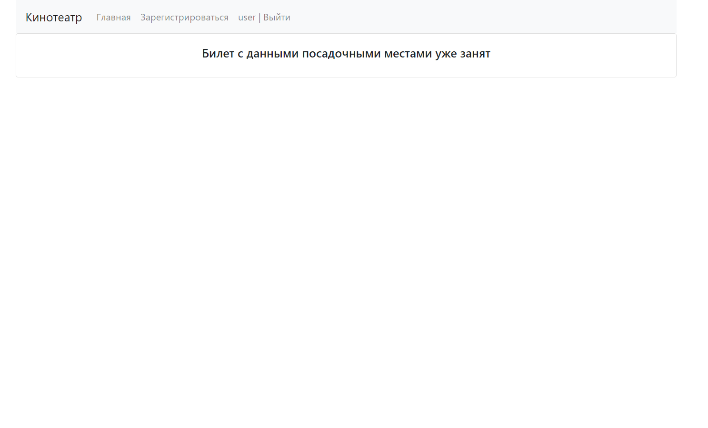

# job4j_cinema
# Описание проекта
Данный проект представляет собой сервис по покупке билетов в кинотеатр. На главной странице показан список всех фильмов. Приобрести билет могут только авторизованные пользователи - для этого нужно зарегистрироваться, а затем пройти авторизацию. При выборе фильма пользователь попадет на страницу с выбором ряда, после чего на страницу с выбором места. После выбора места пользователь попадет на страницу с информацией о сеансе с двумя кнопками "купить" и "отменить". Пользователь может купить билет на сеанс только при условии, что выбранные им места не заняты другим пользователем. Добавлять и изменять сеансы может администратор, для этого необходимо зарегестрироваться под именем "admin"
# Стек технологий
- Java 17
- SpringBoot 2.7.4
- Thymeleaf
- Bootstrap
- PostgreSQL 14
- Junit 5.9.1
- AssertJ 3.23.1
- Log4j 1.2.17
- Jcip annotations 1.0
- h2database 2.1.214
- Mockito 3.5.13
- Checkstyle-plugin 3.1.2
- Liquibase 4.15.0
# Требования к окружению
- Java 17
- Maven 3.8
- PostgreSQL 14
# Запуск проекта
1. В PostgreSQL создать базу данных cinema ```jdbc:postgresql://127.0.0.1:5432/cinema```
2. Собрать jar файл с помощью ```mvn install```
3. Запустить приложение с помощью собранного jar-файла ```java -jar target/job4j_cinema-1.0.jar```
4. Перейти по адресу ```http://localhost:8080/allSessions```
# Взаимодействие с приложением
### Страница регистрации


### Страница с успешной регистрацией


### Страница авторизации


### Главная страница


### Страница с выбором ряда


### Страница с выбором места


### Страцниа с информацией о сеансе


### Страница об успешной покупке билета


### Страница о том, что места уже заняты


### Страница с возможностью добавления и редактирования сеансов

# Контакты
- Telegram: https://t.me/ilya96s
- GitHub: https://github.com/Ilya96s
